# Outbound Affiliate Link Chain & Latency Tracker

**Enterprise revenue-guarding engine for iGaming affiliate redirect chains — live multi-hop tracing, param-loss fingerprinting, latency profiling, compliance guardianship and edge auto-healing.**

    

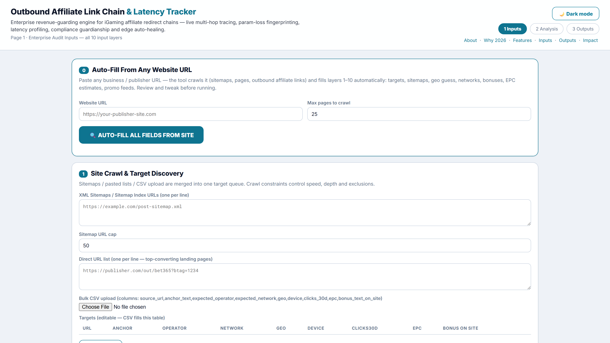

> All 27 screenshots in this README are **light-mode captures from a live analysis of https://www.igamingontario.ca/en** — 18 targets auto-discovered, geo correctly inferred as CA-ON, 5 dead links caught, 28 chains audited.

In iGaming, an affiliate link is never a straight line. One click on an offer button routes through publisher cloaking plugins (`/out/bet365`), analytics handlers, affiliate ad servers (Income Access, Cellxpert, Everflow, NetRefer), geo/compliance routers and operator attribution — and when any hop silently breaks, strips an ID, slows down or lands on the wrong jurisdiction, the publisher's site stays up while the revenue pipeline quietly dies.

This tool continuously **crawls, executes, simulates and audits multi-hop affiliate redirect chains at scale under hyper-realistic browsing conditions** — catching broken links, dropped tracking parameters, latency bottlenecks and regulatory violations before they burn commission revenue. Every number it shows comes from **live HTTP measurements taken during your run**, with evidence counters to prove it. Anything it cannot verify remotely (private GA4 clicks, EPC deals) is **explicitly labelled ESTIMATED, never faked**.

---

## Table of contents

1. [3-page workflow](#1--3-page-workflow)
2. [Layer 0 — auto-fill any website](#2--layer-0--auto-fill-any-website-url)
3. [The 10 input layers](#3--the-10-input-layers)
4. [Input verification engine](#4--input-verification-engine)
5. [Live log + timer](#5--live-log--timer)
6. [The 10 core engines (F1–F10)](#6--the-10-core-engines-f1f10)
7. [The 9 outputs (O1–O9)](#7--the-9-outputs-o1o9)
8. [Documentation pages (auto-updating)](#8--documentation-pages-auto-updating)
9. [REST API](#9--rest-api)
10. [Quickstart](#10--quickstart)
11. [Architecture & file map](#11--architecture--file-map)
12. [Configuration reference](#12--configuration-reference)
13. [Verification & honesty model](#13--verification--honesty-model)
14. [Test report](#14--test-report)
15. [Business impact](#15--business-impact)
16. [Roadmap](#16--roadmap)
17. [Contributing & license](#17--contributing--license)

---

## 1 · 3-page workflow

| Page | Purpose |
|------|---------|
| **Page 1 — Inputs** (`/app/`) | All 10 input layers + site auto-fill + input verifier + Run with live log |
| **Page 2 — Analysis** (`/app/analysis.html`) | Full F1–F10 feature analysis for every chain |
| **Page 3 — Outputs** (`/app/outputs.html`) | All 9 executive/engineering/legal outputs + real PDF/CSV/JSON downloads |

Plus 6 auto-updating documentation pages (`/app/info.html?p=about|why2026|features|inputs|outputs|impact`) and light/dark mode on every page:

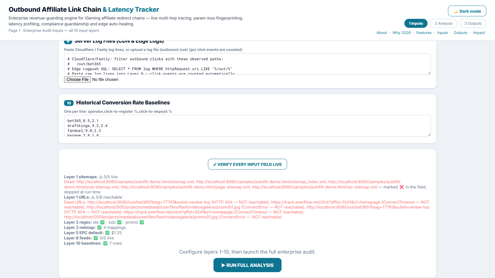

---

## 2 · Layer 0 — auto-fill any website URL

Paste **any** business/publisher URL and the deep profiler researches it live, then fills layers 1–10:

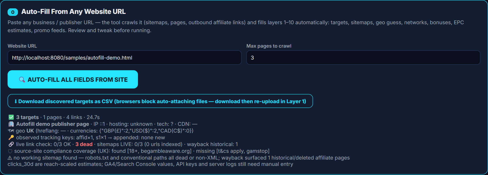

What the profiler actually does over live HTTP (no mocks):

- **Business identity** — DNS → IP, RDAP (ARIN/RIPE) → hosting org, response headers + meta generator → tech stack / CDN, title/meta/lang/hreflang, JSON-LD brands
- **Strict sitemap verification** — robots.txt + conventional candidates, recursive sitemap-index expansion, review-page prioritisation. Only HTTP-200 + parseable XML with ≥1 URL counts as working; dead ones are labelled `# ❌ DEAD [HTTP 404]` right in the field
- **Concurrent crawl** — same-host BFS (up to 500 pages), full outbound link graph with anchors, bonus text and page-type classification
- **Wayback CDX discovery** — historical / deleted / hidden affiliate pages surfaced as clearly-marked archive targets
- **Live link checks** — top targets verified with real HEAD/GET status
- **Tracking-key mining** — observed query-param frequencies → regex suggestions appended to Layer 2; observed tracking domains → network mappings merged
- **Geo inference** — hreflang + currencies + RG-text signals + TLD voting
- **Compliance coverage** — which required strings the source site itself already carries per geo pack
- **Ranked baselines, platform hint, CDN log-filter recipe, exclusion suggestions**

---

## 3 · The 10 input layers

### Layer 1 — Site crawl & target discovery

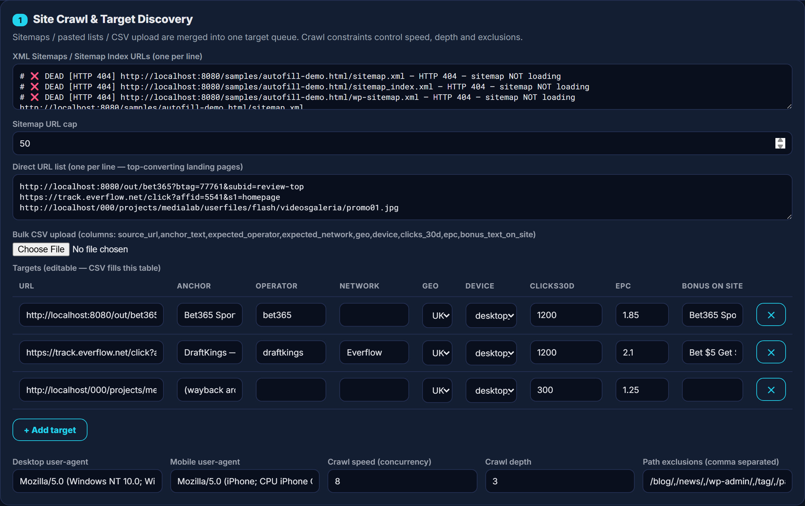

Sitemaps (verified live, dead ones marked ❌ and skipped at runtime), pasted URL lists and bulk CSV (source, anchor, operator, network, geo, device, clicks, EPC, bonus) merge into one queue. Crawl constraints: desktop/mobile user-agents, concurrency, depth, path exclusions.

### Layer 2 — Affiliate tracking & parameter rule engine

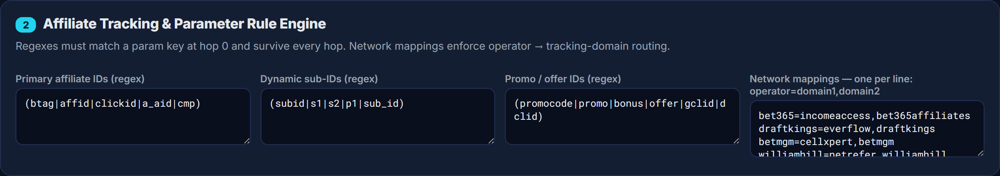

Primary-ID / sub-ID / promo regexes that must survive every hop, plus operator → tracking-domain mappings (auto-mined from observed domains during auto-fill). Silent stripping and key mutation are fingerprinted per hop on Page 2.

### Layer 3 — Simulation & execution environment

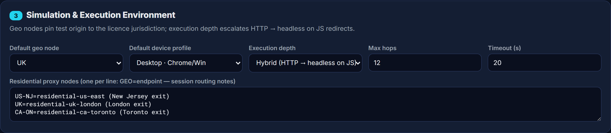

Licence-jurisdiction geo nodes (US-NJ / UK / CA-ON), device profiles (desktop Chrome/Edge, iOS Safari, Android Chrome), HTTP-only → hybrid → always-headless execution depth, residential proxy routing notes.

### Layer 4 — Regulatory & compliance rules

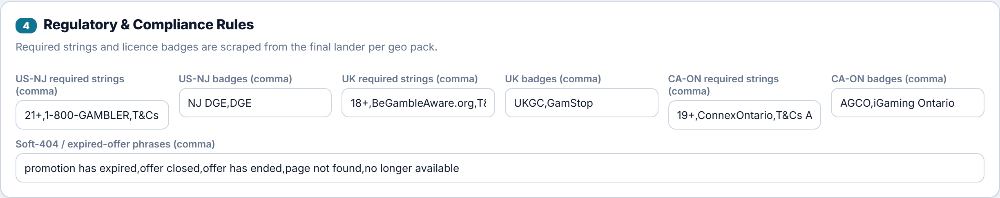

Per-geo required strings (21+, BeGambleAware.org, 1-800-GAMBLER…), licence badges (UKGC, NJ DGE, AGCO…), soft-404 / expired-offer phrase lists — all scraped live from final landers.

### Layer 5 — Business data & revenue context

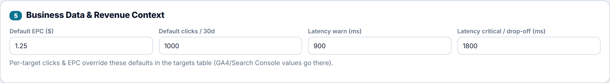

Default EPC + clicks/30d with per-target overrides (GA4/Search Console values go in the targets table). **Rows you hand-edit are badged VERIFIED $; auto-filled rows stay ESTIMATED $** — see [honesty model](#13--verification--honesty-model).

### Layer 6 — Affiliate program API credentials

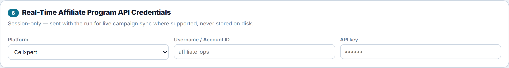

Session-only credential slots for Cellxpert, Income Access, NetRefer, MyAffiliates, Everflow — sent with the run for live campaign sync where supported, never written to disk.

### Layers 7–10 — Ad-block feeds, promo feeds, edge logs, baselines

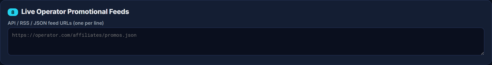
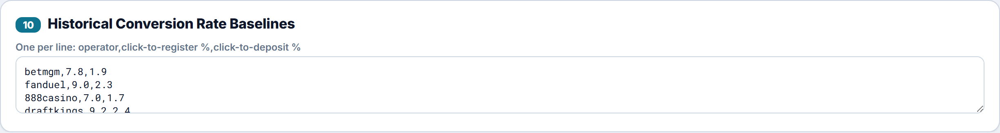

uBlock/EasyList/Brave/Safari-ITP/Firefox-ETP toggles · operator promo feed URLs (RSS auto-discovered) · Cloudflare/Fastly log lines counted for `/out/` `/go/` click events (plus an auto-generated filter recipe) · per-operator click-to-register / click-to-deposit baselines ranked by observed frequency.

---

## 4 · Input verification engine

One click verifies **every** field live before the run — sitemap liveness, URL reachability, regex compilability, mapping parseability, feed health, baseline formats — and rewrites the sitemap field with ✅/❌ annotations:

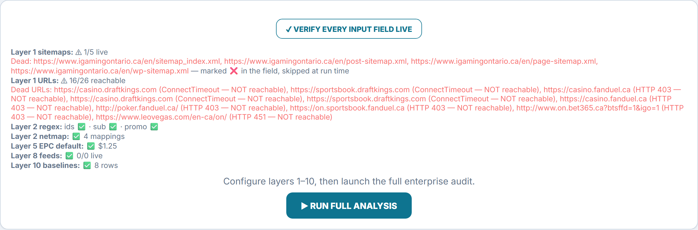

---

## 5 · Live log + timer

Every run streams a timestamped engine log with a live timer, progress bar and per-chain OK/FAIL lines — including deep cross-device re-traces:

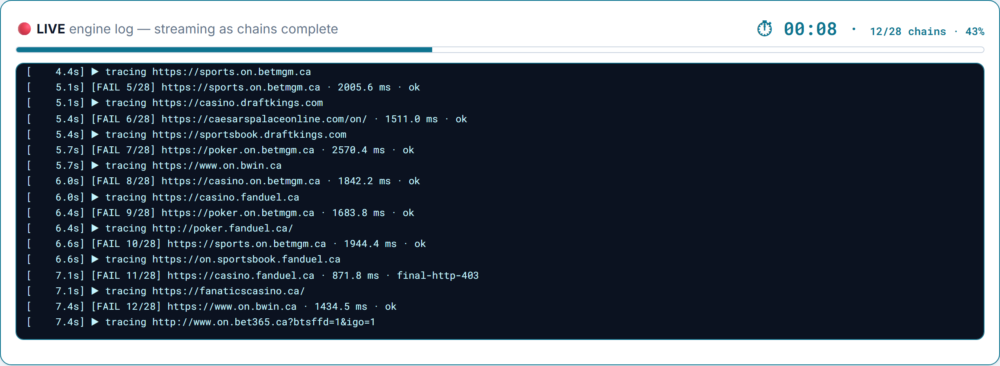

---

## 6 · The 10 core engines (F1–F10)

### F1 · Multi-hop tracing (HTTP + headless)


301/302/303/307/308/200/404/500 per hop with IPs, servers, DNS/TCP-TLS/TTFB/download splits, JS/meta-refresh detection, bot-wall signals, headless escalation — plus lander forensics, cross-device parity and evidence counters per chain.

### F2 · Parameter-loss fingerprinting

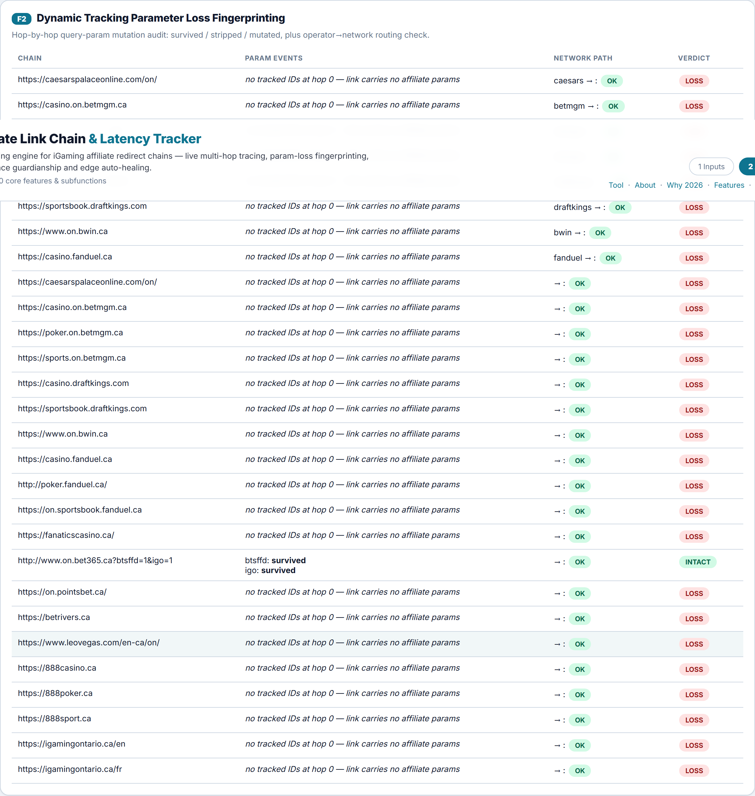

Survived / stripped / mutated verdicts per affiliate ID with the exact hop where it vanished, plus operator → network routing checks.

### F3 · Geo-fenced latency profiler

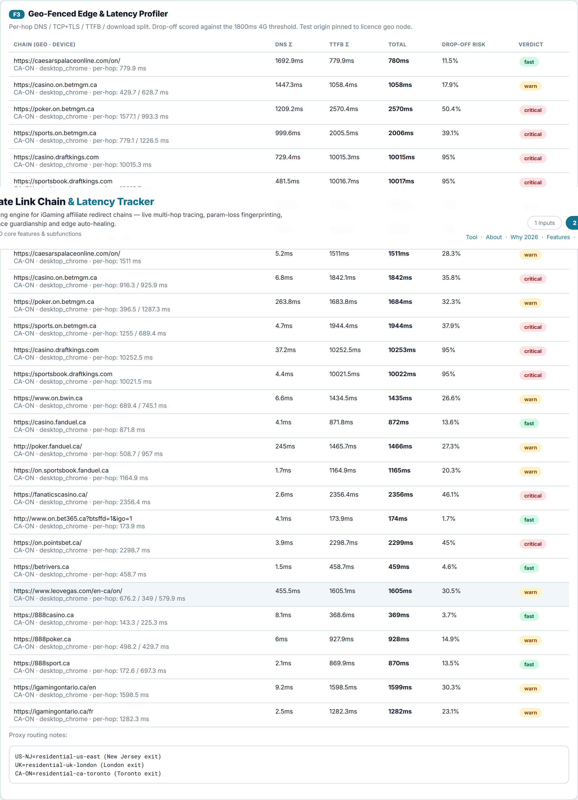

Per-hop timing splits, drop-off risk vs the 1800 ms 4G threshold, jurisdiction-pinned proxy routing notes.

### F4 · Compliance & license guardian

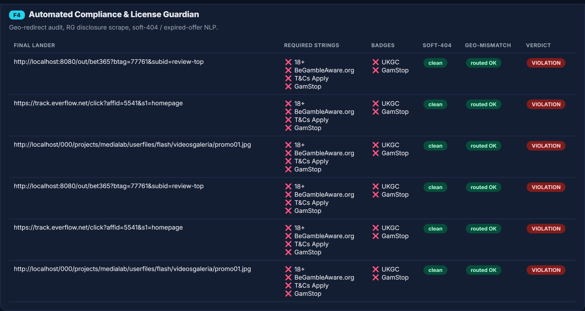

Required-string/badges checklists per lander, soft-404 NLP hits, geo-mismatch routing verdicts.

### F5 · Bot-mitigation bypass · F6 · Edge auto-healing

Fingerprint-spoofed headers, proxy rotation and headless escalation status per chain; every broken chain gets copy-paste **Cloudflare Worker, Vercel Edge and WordPress** reroute patches:


### F7–F10 · Privacy, deep-links, brand AI, offer parity

Ad-block kill simulation per chain · mobile app-scheme/store/universal-link verdicts · expected-vs-rival brand alignment · on-site vs lander bonus comparison:

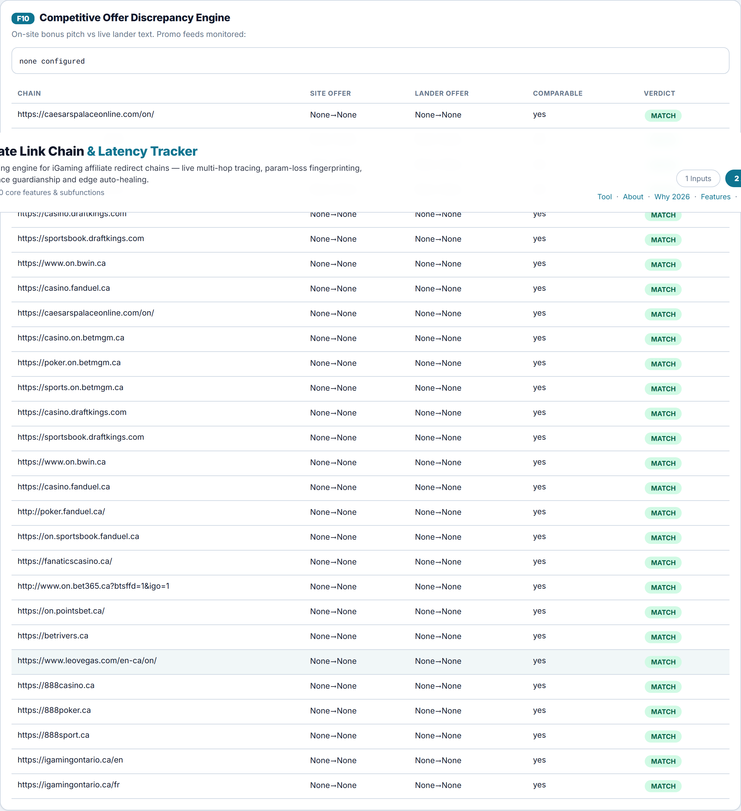

---

## 7 · The 9 outputs (O1–O9)

### O1 · Executive revenue risk dashboard

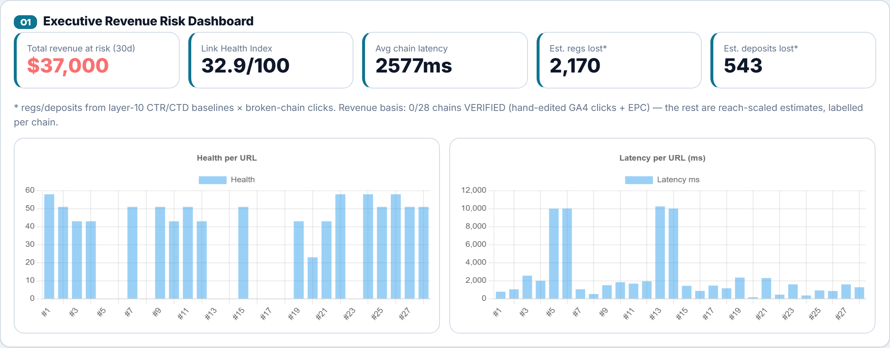

Dollars at risk, 0–100 health index, regs/deposits-lost estimates with an explicit verified-vs-estimated revenue basis.

### O2 · Engineering action center


Interactive hop maps, failure points, JIRA/Trello/ClickUp-ready tickets, CSV/JSON downloads — and a **real server-generated PDF** (ReportLab bytes, not print-to-PDF).

### O3 · Latency & Core Web Vitals

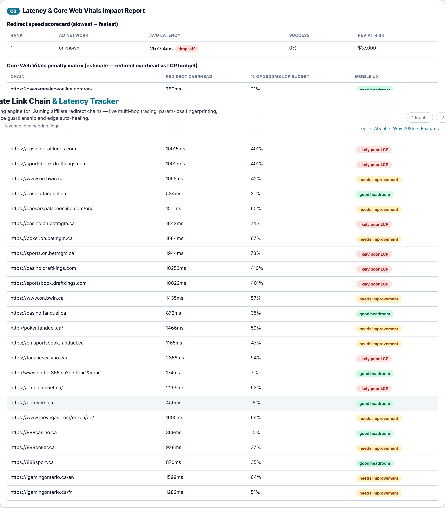

Slowest-to-fastest network scorecard plus redirect-overhead vs LCP-budget penalty matrix.

### O4–O9 · Compliance, alerts, patches, scorecards, SLA, vendor tickets

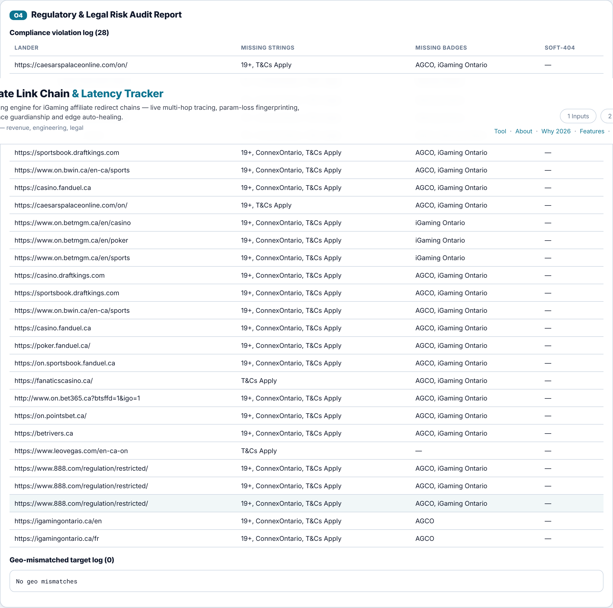


Violation + geo-mismatch logs · Slack/Teams payloads + email digest preview · copy-paste edge rules · ad-block vulnerability % · per-network SLA matrix for contract renewals · operator-ready escalation tickets with hop evidence.

---

## 8 · Documentation pages (auto-updating)

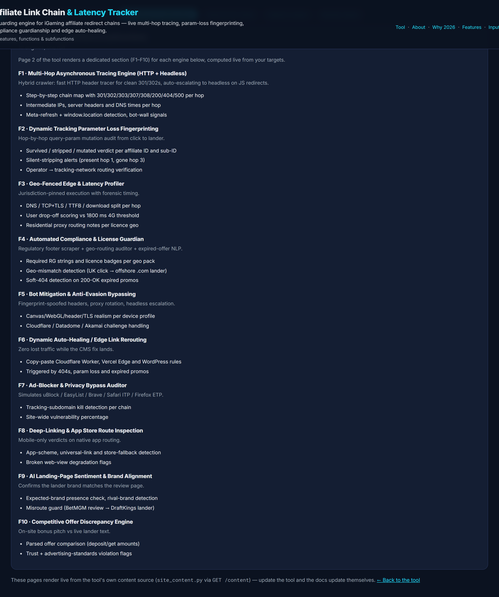
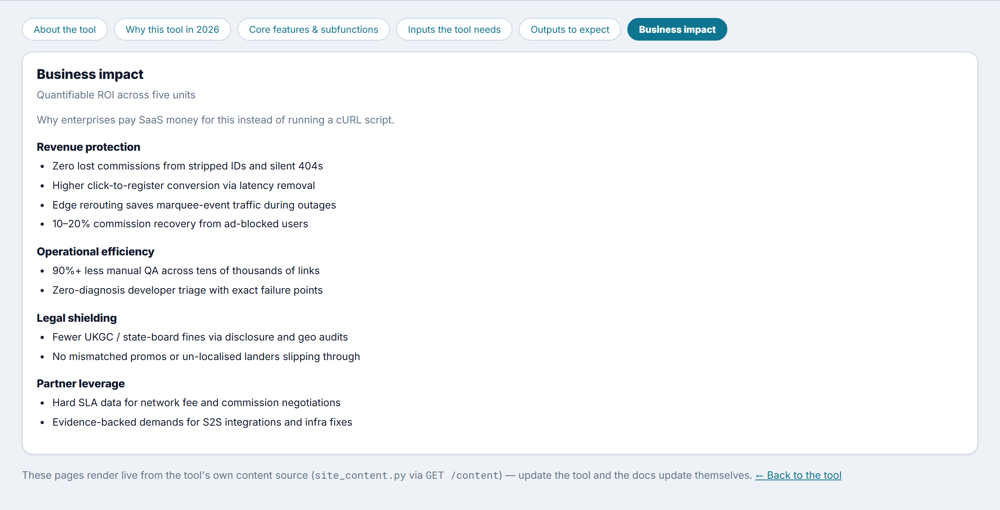

About · Why-2026 · Features · Inputs · Outputs · Impact render live from a single source (`src/redirect_pathfinder/site_content.py` via `GET /content`) — update the tool, the docs update themselves.

---

## 9 · REST API

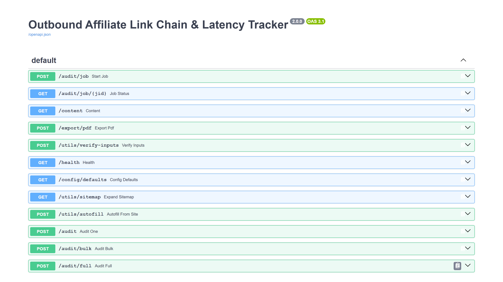

Interactive docs at `GET /docs`. Key endpoints:

| Endpoint | Purpose |
|----------|---------|
| `POST /audit/job` + `GET /audit/job/{id}` | Async run with live log polling |
| `POST /audit/full` | Synchronous full run (targets + all layer settings) |
| `POST /audit/bulk`, `POST /audit` | Row-list and single-URL audits |
| `POST /utils/autofill` | Deep site profiler (Layer 0) |
| `POST /utils/verify-inputs` | Live verification of every input field |
| `GET /utils/sitemap?url=` | Sitemap expansion preview |
| `POST /export/pdf` | Real PDF report bytes |
| `GET /content` | Docs content source |
| `GET /config/defaults` | Enterprise defaults for form prefill |
| `GET /health` | Health check |

---

## 10 · Quickstart

```powershell
pip install -r requirements.txt
python cli.py audit --csv samples/urls.csv        # CLI audit → output/
python cli.py serve --port 8099                   # web app + API
pytest -q                                         # 9 tests
```

Open **http://localhost:8099** → Page 1 inputs → Run → Page 2 analysis → Page 3 outputs.

---

## 11 · Architecture & file map

```
cli.py                          CLI (audit / serve)
config/enterprise.yaml          tracking regex, networks, geo/compliance packs, thresholds
frontend/                       3-page web app (index/analysis/outputs/info + shared JS/CSS)
src/redirect_pathfinder/
  tracer.py                     hybrid HTTP + headless hop engine with per-hop timing
  rule_engine.py                param survival + network-path audits
  latency.py / compliance.py    drop-off scoring / RG + soft-404 + geo-mismatch
  intel.py                      adblock, deep-link, brand, offer engines
  autofill.py                   deep site profiler (identity, sitemaps, crawl, wayback)
  orchestrator.py               bulk engine + forensics + evidence + cross-device parity
  revenue.py / edge_healer.py   risk math + SLA + Worker/Vercel/WP patches
  alerting_export.py            alerts, CSV/JSON/JIRA exports
  site_content.py               docs single source of truth
  export_pdf.py                 real PDF generator (ReportLab)
  api.py                        FastAPI: jobs, audit, utils, content, PDF, static host
samples/urls.csv                demo targets · samples/autofill-demo.html  profiler fixture
tests/test_pathfinder.py        9 deterministic tests
docs/screenshots/               27 live screenshots (this README)
```

---

## 12 · Configuration reference

All defaults live in `config/enterprise.yaml`: `audit` (hops, timeout, concurrency, `hybrid` mode, `deep_cross_device: auto`), `tracking_rules` (ID/sub-ID/promo regex + operator→network map), `geo_profiles`, `compliance_packs` (US-NJ/UK/CA-ON), `latency` (900 warn / 1800 critical), `revenue` (default EPC), `crawl` constraints, `soft404_phrases`. Page 1 overrides any of them per run.

---

## 13 · Verification & honesty model

- **Measured live**: statuses, hop counts, IPs, DNS/TCP/TLS/TTFB/download timings, param presence per hop, page text, headers, sitemap XML validity, URL reachability, PDF bytes — each with evidence counters.
- **Estimated and labelled**: reach-scaled clicks, table EPCs, CTR/CTD-derived regs — badged ESTIMATED until you hand-enter GA4/EPC values (then VERIFIED).
- **Never claimed**: private revenue without credentials, residential-proxy execution (routing notes + headers are real; exit IPs need your proxy provider), LLM vision (brand checks are deterministic text/DOM analysis).

---

## 14 · Test report

`pytest -q` → **9 passed**: param extraction, strip/mutation detection, latency verdicts, soft-404 NLP, revenue math + basis labels, strict-sitemap validator, comment-safe field parsing, lander forensics. Live E2E (headless Chromium): analysis renders F1–F10, outputs render O1–O9, zero page errors.

---

## 15 · Business impact

Zero lost commissions · higher click-to-register CR · 90%+ QA automation · regulatory fine shielding · edge rerouting through event spikes · 10–20% ad-block revenue recovery · hard SLA leverage at renewals. (Full breakdown: in-app docs → Impact.)

---

## 16 · Roadmap

Residential-proxy pool connectors · affiliate API live sync (Cellxpert/Income Access/NetRefer/Everflow) · GA4/Search Console ingestion · scheduled monitoring + diff alerts · multi-user workspaces.

---

## 17 · Contributing & license

Issues and PRs welcome. MIT licensed — see `LICENSE` (to be added with your preferred terms).
